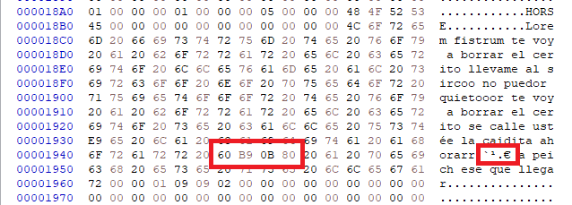
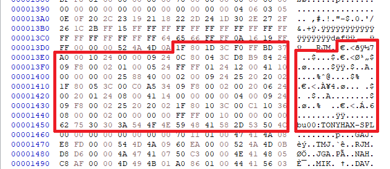

---
---

tonyhax
=======

Software backup loader exploit thing for the Sony PlayStation 1.

<iframe width="560" height="315" src="https://www.youtube.com/embed/TO6msoWZa2I" frameborder="0" allow="accelerometer; autoplay; clipboard-write; encrypted-media; gyroscope; picture-in-picture" allowfullscreen style="width: 100%; height: 100vh; min-height: 15em; max-height: 25em;"></iframe>

Why?
----

The first question that might pop up on your mind regarding this project is "why the fuck didn't you just install a modchip?".

The answer is simple: I didn't want to mod my mint, boxed PSone, but I didn't want to leave it rotting on a shelf either.

Also, as an owner of a SCPH-102 console, these are a pain in the ass when it comes to chipping - in addition to the generic SCEx wobble check performed by the CD controller that is easily patchable, the boot menu on these also checks for the region string, which involve installing even more wires and a full sized Arduino Pro Mini or AtMega328 chip to patch the CPU BIOS to play out of region games. Not cool.

How does this works?
--------------------

In layman terms, this exploit uses an oversight from the programmers: the game does not check that the skater name in the save file hasn't been tampered and fits in the space the program allocated for it. If we externally change the username to something longer, we can overwrite other vital parts of the memory and run our own code.

In more technical terms, this exploit consists of a specially crafted save game with:

 - Highscores replaced with a first-stage payload of 144 bytes.
 - An abnormally long skater name, with the memory address of the first-stage payload inserted.



When entering the skater customization menu, the menu is dinamically generated to include the saved skater names in a way like:

```c

void trim_string(char * buffer, int len) {
	char trimmed[x];

	// Copy to our local buffer
	strcpy(trimmed, buffer);

	// Trim it
	trimmed[len - 4] = '.';
	trimmed[len - 3] = '.';
	trimmed[len - 2] = '.';
	trimmed[len - 1] = 0;

	// Copy back to the original buffer
	strcpy(buffer, trimmed);
}

void create_skater_entry(int id) {
	char menutext[x];
	int textlen;

	sprintf(menutext, "Skater %c: %s", 'A' + id, custom_skater_data[id].name);
	while ((textlen = strlen(menutext)) > MAX_LEN) {
		trim_string(menutext, textlen);
	}

	// ...
}
```

Essentially, if a string that's too long to overflow the buffer is specified, the buffer overflows and overwrites part of the stack as we want to, but then it gets hammered with periods.

**However**, as `trim_string` is a a subcall and has a local buffer, if we specify a character name with the right length (165 characters, exactly), the null terminator in the `trimmed` buffer overlaps the first character of `menutext`, resulting in a menu entry with length of 0, thus sparing the rest of the stack contents.

After some more menu-related stuff, the return address is finally pulled from the stack and the code jumps to it. This return address points to the beginning of the high scores menu, whose contents are also loaded with no checks from the memory card, and where we have the first-stage payload.



This first stage payload is about 144 bytes, and its sole purpose is to load the secondary program loader (or SPL for short) from an additional save file in the memory card using the PS1 BIOS calls. Once loaded, it jumps straight to it.

As the console is left in an inconsistent state, the SPL first reinitializes the system kernel (RAM, devices...), by using the very same calls the ROM executes during the booting of the console.

After that, the GPU is reset. Once the GPU is ready again, the sets up the video to a resolution of 320x240, unpacks the 1bpp font from the BIOS ROM into VRAM, and draws the basic border and program name to know everything is working fine until this point.

With a fully working screen, it then proceeds to unlocks the CD drive to accept discs missing the SCEx signature, leveraging the [CD BIOS unlock commands](https://problemkaputt.de/psx-spx.htm#cdromsecretunlockcommands) found by Martin Korth. These unlock commands are a sort of backdoor, and the drive, probably in order to keep them secret, returns an error instead of a success message. The SPL is coded to expect a particular error to be returned, and will actually abort if the drive returns that it succeeded or if it returns another unexpected error code.

After unlocking it, it waits for the lid to be opened and closed, allowing the user to insert a new CD.

After that, the CD filesystem is reinitialized. It proceeds to read the SYSTEM.CNF configuration file, reinitializes the kernel with the parameters the game needs, and finally loads and runs the game's main executable.

Installation
------------

To install this exploit, you'd need a means of copying the save file to a PS1 memory card. Personally, I've used a PS2 with [Free McBoot](https://www.ps2-home.com/forum/viewtopic.php?t=1248) and uLaunchELF.

All you have to do is copy the game's crafted save file and the `TONYHAX-SPL` file into the card. That's it.

Once installed, you can freely copy it to other cards using the PS1 and the memory card management menu, and distribute it freely amongst friends.

Usage
-----

Once installed, all you have to do is boot the game like you'd normally do.

Once you get to the main menu, it'll load the save game (it should say "Loading TONYHAX"). After it's done, go to the "CREATE SKATER" function and press X. After a couple seconds, tonyhax should boot.

Save games
----------

 * `BASLUS-01066TNHXG01`: Tony Hawk's Pro Skater 2 (NTSC-U) (SLUS-01066)
 * `BESLES-02908TNHXG01`: Tony Hawk's Pro Skater 2 (PAL-E) (SLES-02908)
 * `BASLUS-01419TNHXG01`: Tony Hawk's Pro Skater 3 (NTSC-U) (SLUS-01419)
 * `BESLES-03645TNHXG01`: Tony Hawk's Pro Skater 3 (PAL-E) (SLES-03645)
 * `TONYHAX`: tonyhax's secondary program loader (SPL)

Compatibility
-------------

I've personally only attempted this with a PAL SCPH-102 PSone, but according to Martin Korth's documentation this should work with:

 * Every PAL console.
 * Every NTSC-U console **except** the very early SCPH-1000.
 * NetYaroze consoles.

However, this will **not** work with:

 * Japanese NTSC-J consoles (stubbed/bugged CD unlock).
 * NTSC-U SCPH-1000 consoles (BIOS predates the introduction of the CD unlock command).

Download
--------

Releases are available at the [GitHub releases page](https://github.com/socram8888/tonyhax/releases).

Source code is also fully available under the [WTFPL license](https://github.com/socram8888/tonyhax/blob/master/LICENSE) at [GitHub](https://github.com/socram8888/tonyhax/).
